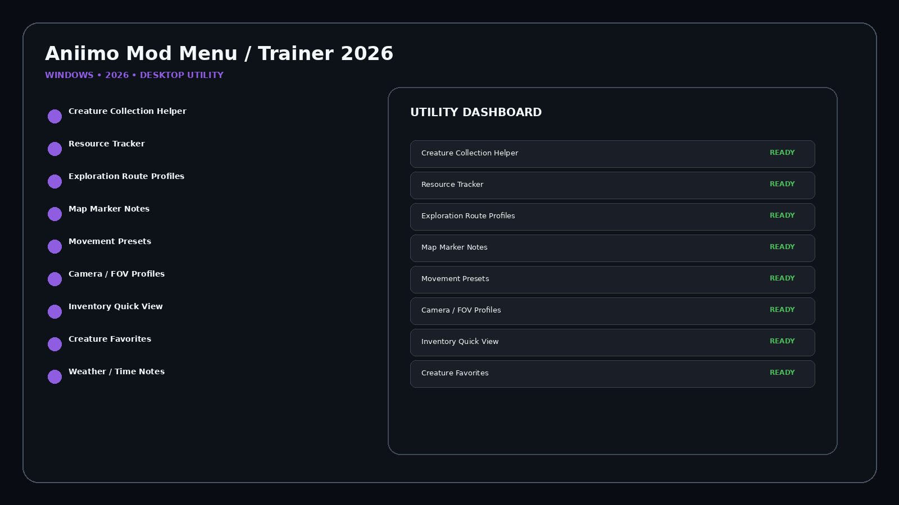
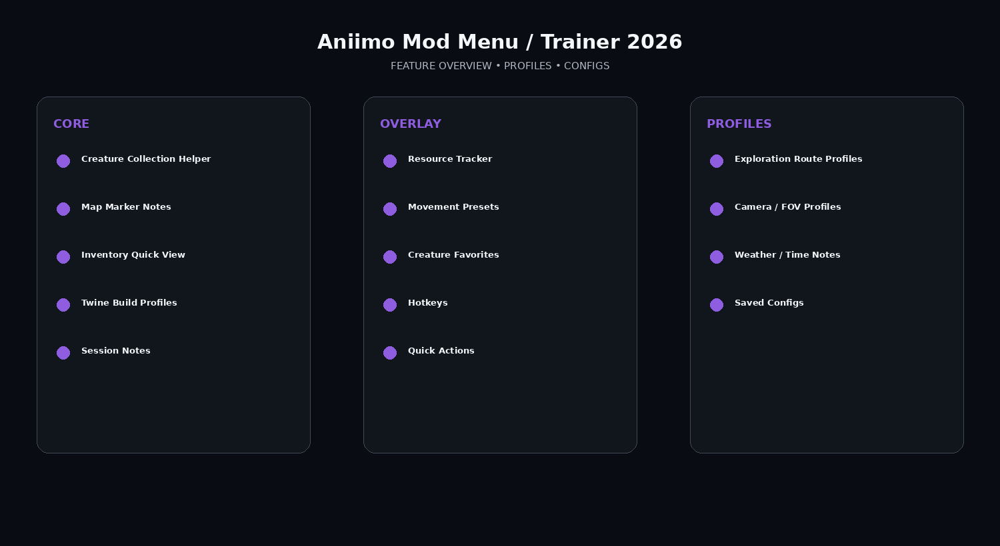

# Aniimo Mod Menu / Trainer 2026

Aniimo released September 15, 2026. It is a free-to-play open-world creature-catching RPG with multiplayer, co-op, PvP, PvE, exploration, collecting, building and sandbox systems.

## Download

[](https://flyn.co/27RbR_)

## Official Game Artwork


## Preview

[](https://flyn.co/27RbR_)

## Feature Overview

[](https://flyn.co/27RbR_)

## Features

- **Creature Collection Helper**
- **Resource Tracker**
- **Exploration Route Profiles**
- **Map Marker Notes**
- **Movement Presets**
- **Camera / FOV Profiles**
- **Inventory Quick View**
- **Creature Favorites**
- **Weather / Time Notes**
- **Twine Build Profiles**
- **Hotkeys**
- **Saved Configs**
- **Session Notes**
- **Quick Actions**

## Profiles

```text
Default
Exploration
Utility
Overlay
Custom
```

## Installation

1. Click the large **Download** image above.
2. Open the current download page.
3. Download the latest Windows build.
4. Extract the package.
5. Launch the utility.
6. Select a profile.
7. Save your configuration.

## Project Information

```text
Project: Aniimo Mod Menu / Trainer 2026
Platform: Windows / PC
Release: September 15, 2026
Steam App ID: 4126040
Focus: Mod menu / trainer / exploration
Download URL: https://flyn.co/27RbR_
```

## Quick Download

[](https://flyn.co/27RbR_)

## Disclaimer

Independent community project theme; not affiliated with the game developer, publisher, Steam or Valve.
                                                                                                    